# **WGB V3 Board Manual**

English | [中文](README_CN.md)

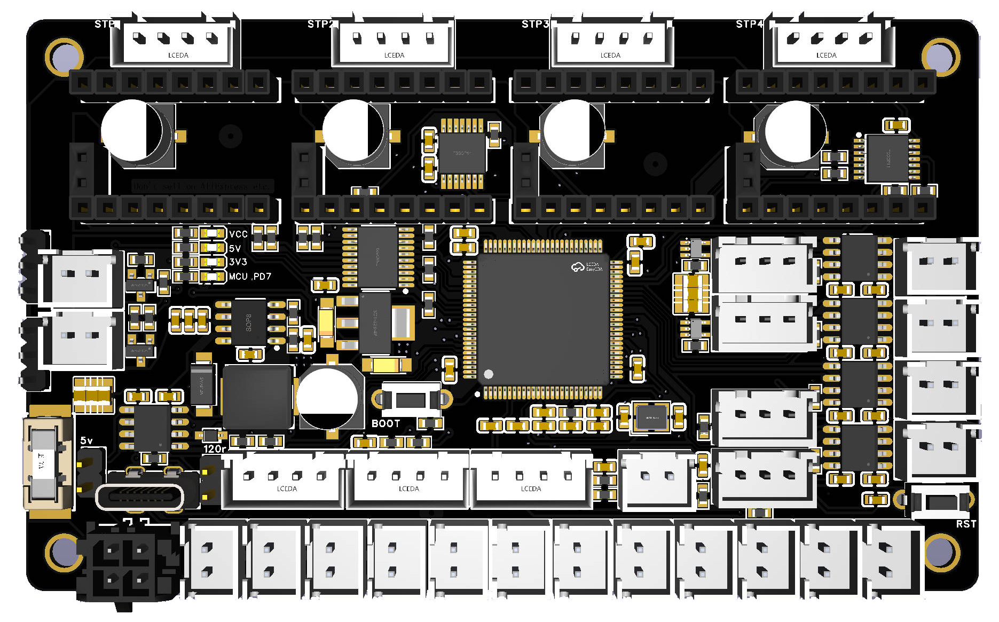

**WGB Board V3 Version (WuGuiBan)** is designed for B-type multi-color systems using DC motor retraction, such as BoxTurtle.

It has the following features:

- **Main Chip**: STM32F446 MCU
- **4 TMC2209-based motor slots** in UART mode, with level conversion for signal isolation between motors and main chip
- **4 x Brushed DC motor drivers** with forward/reverse support, En pin, and sleep mode
- **2 x RGB LED connectors** with servo support
- **16 x Microswitch control connectors** for conventional B-type multi-color needs, with redundant interface design for retraction buttons, encoders, and other functions
- **2 x 5V/24V fan connectors** (with speed control, voltage selection via jumper)
- **1 x I2C interface** for connecting temperature and humidity sensors
- **1 x Temperature measurement interface** for DIY multi-color drying with fan interface and relay
- **USB and CAN support**. CAN uses MX3.0 2x2p with foolproof design
- **Compatible dimensions** with Turtle Box multi-color board AFC-Lite mounting holes

## **1. PIN Diagram**

!! Refer to Section 4 for wiring diagram !!

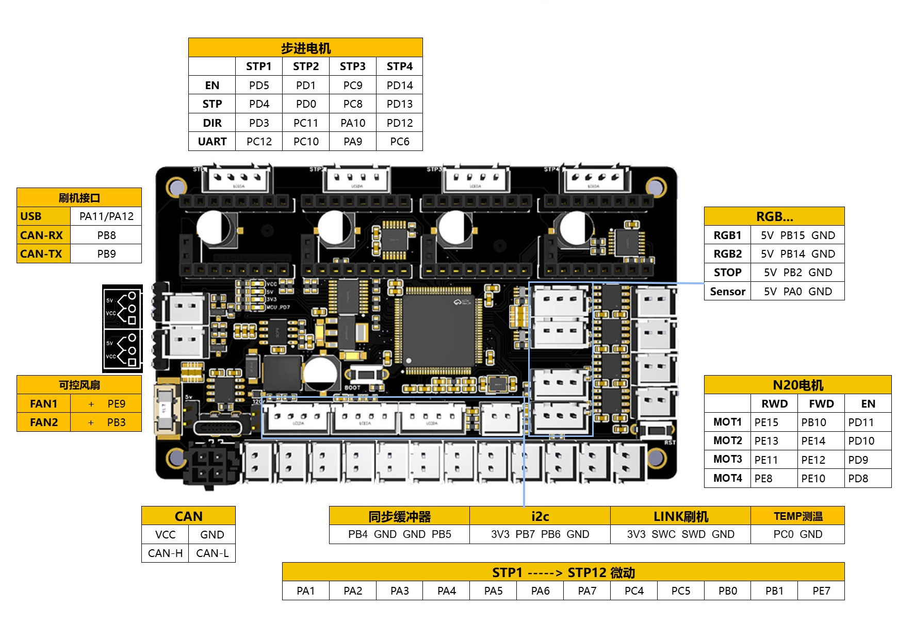

## **2. Firmware Flashing Tutorial (No Canboot)**

### **2.1 Firmware Compilation**

SSH into the host computer

```bash
# Navigate to klipper directory
cd ~/klipper

# Clean previous compilation
make clean

# Configure compilation parameters [refer to image below]
make menuconfig
```


Set compilation parameters according to your protocol needs

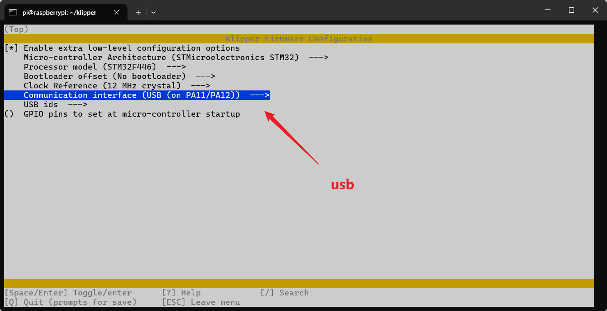

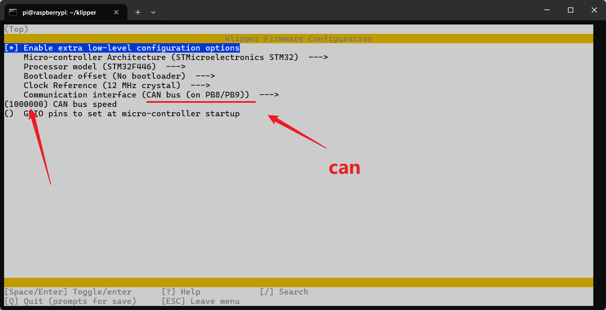

Press q to exit, y to save

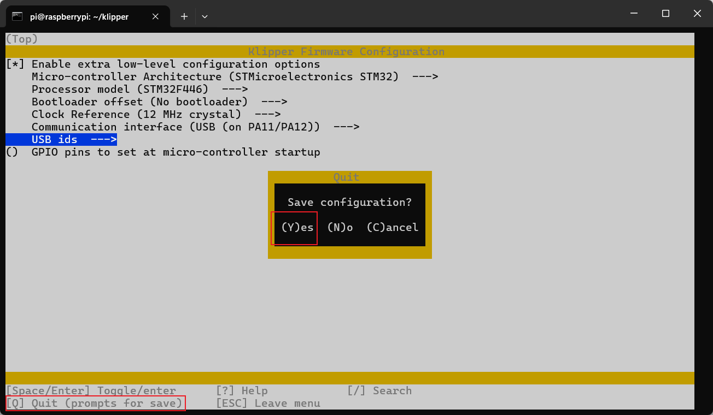

Enter make command to start compilation

```bash
make
```

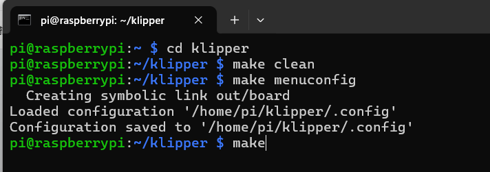

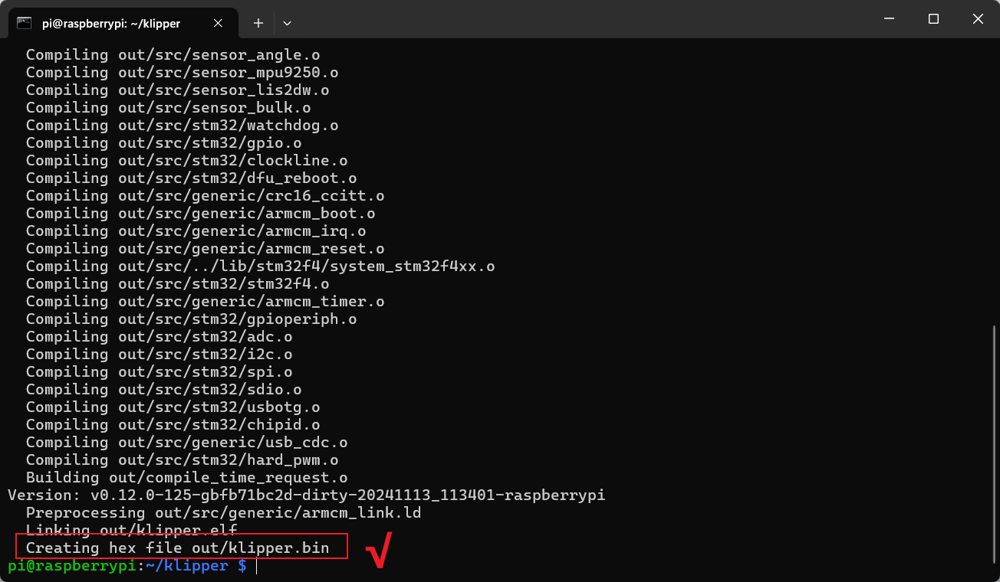

### **2.2 Firmware Flashing**

**1: Enter DFU mode**

Use a jumper to short-circuit the 5V USB jumper. After short-circuiting, you can use USB to power and flash the board. **Remember to remove the jumper after flashing is complete.**

If using 24V power supply, no short-circuit is needed, but you can only use Method 2 below to enter DFU.

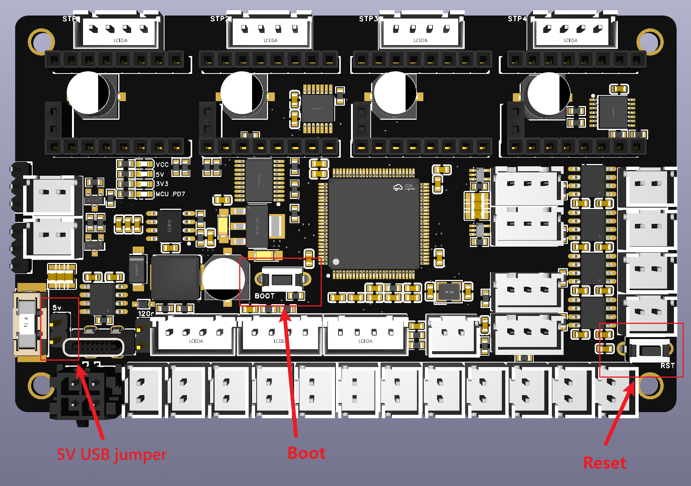

**DFU Method 1**: After the board is completely powered off, hold down Boot, connect the board to the host computer using a TypeC cable, then release Boot.

**DFU Method 2**: If the board is not powered off, connect it to the host computer using a TypeC cable, then hold down Boot, press the Reset button, release the Reset button, and finally release the Boot button.

**2: Enter `lsusb` in SSH to check if the DFU device appears. Normally, the DFU device should appear. If it doesn't appear, repeat the operation.**

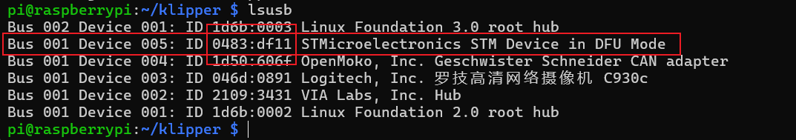

**3: Enter the following in SSH:**

```bash
# Make sure you're in the klipper directory
cd ~/klipper

# 0483:df11 is the ID found from the previous lsusb command
# If make is not found, install it using: sudo apt install dfu-util -y

make flash FLASH_DEVICE=0483:df11
```

The flashing operation will then proceed [you may need to enter a password]. Wait for the progress bar to complete and "successfully" to appear, which indicates successful flashing. Ignore any errors after "successfully".

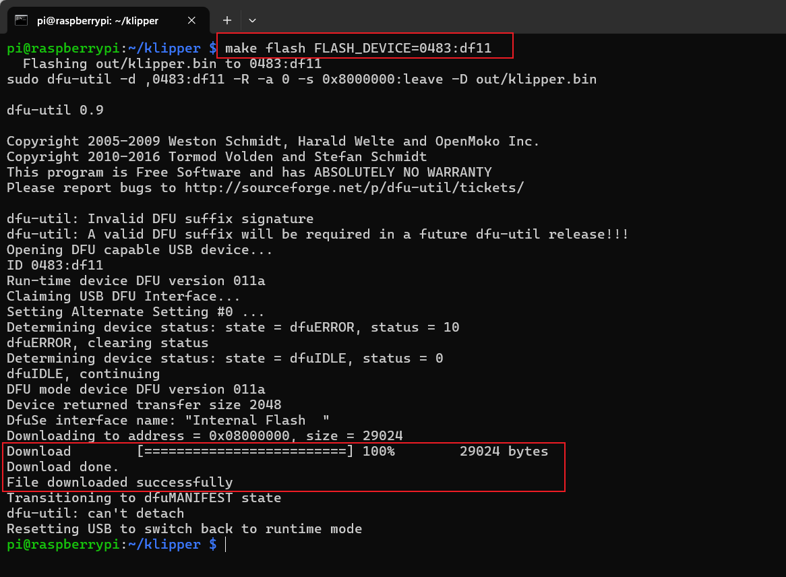


Flashing completed

**2.3 Get Serial ID or CAN UUID**

**2.3.1 If using USB protocol:**

Reconnect the USB data cable and use `lsusb` to check if there's an STM32F446 device.

Use the following command to view the device serial ID:

```bash
ls /dev/serial/by-id/
```

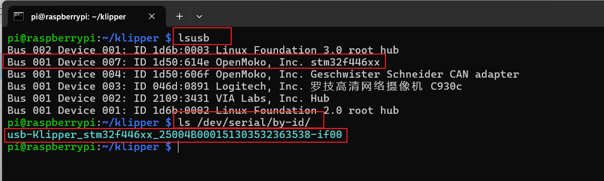

The device serial ID for this device is:

```bash
serial: /dev/serial/by-id/usb-Klipper_stm32f446xx_25004B000151303532363538-if00
```

**For later use, please remove the 5V USB jumper and connect 24V power to the CAN interface**

**2.3.2 If using CAN protocol:**

Connect CAN signal lines and 24V power supply.

**Note 1: Remember to remove the 5V USB jumper.**

**Note 2: If there are multiple CAN devices, only short-circuit the 120Ω resistor on one device**

**Note 3: Pay attention to the wiring sequence of 24V GND CAN-H CAN-L. Check carefully, incorrect wiring may cause board damage at your own risk.**

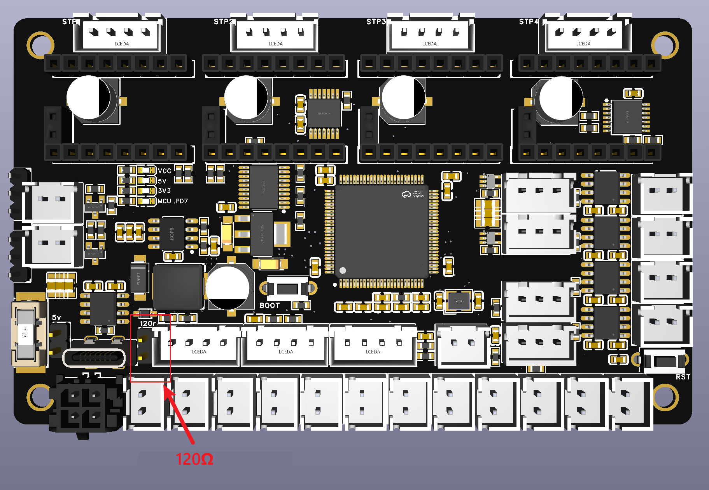

Then use the following command to view UUID:

```bash
~/klippy-env/bin/python ~/klipper/scripts/canbus_query.py can0
```

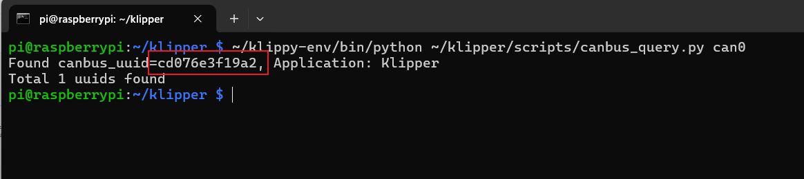

## **3. Firmware Flashing Tutorial (With Canboot)**

For those who need to use canboot (katapult), follow the tutorial below

First, SSH into the host computer

```bash
ssh username@IP_address
```

### **3.1 Flash Canboot**

```bash
# Go to home directory
cd ~

# Download katapult (skip if already exists)
git clone https://github.com/Arksine/katapult

# Enter katapult directory
cd katapult
```

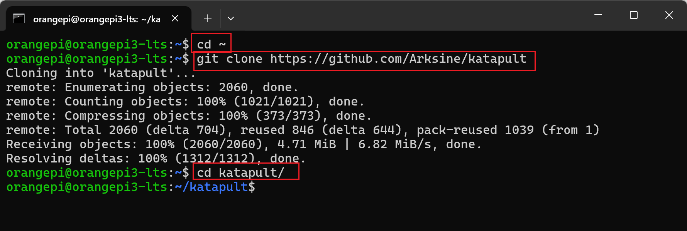

```bash
# Modify compilation configuration, fill in the parameters according to the image below
make menuconfig

# After verification, press q to exit, select y, then enter make to start compilation
make
```

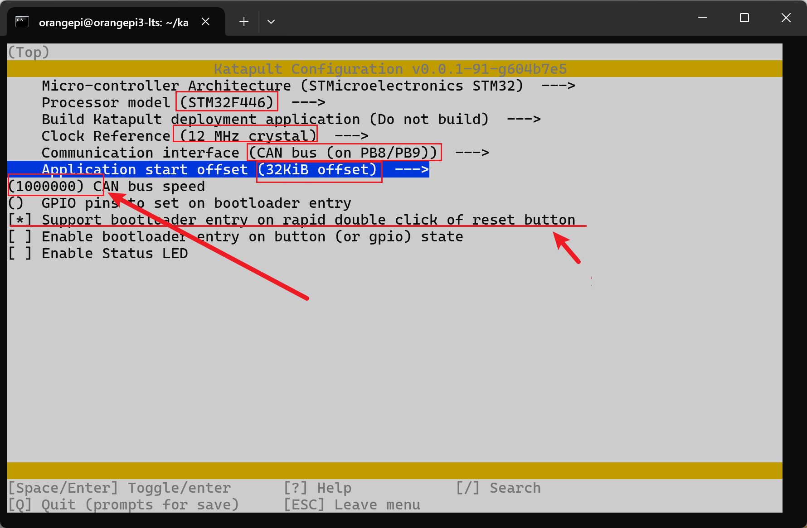

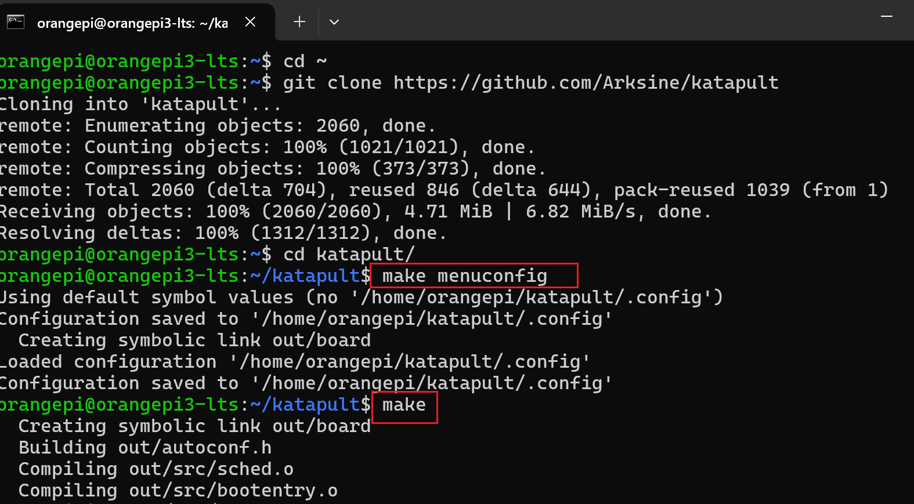

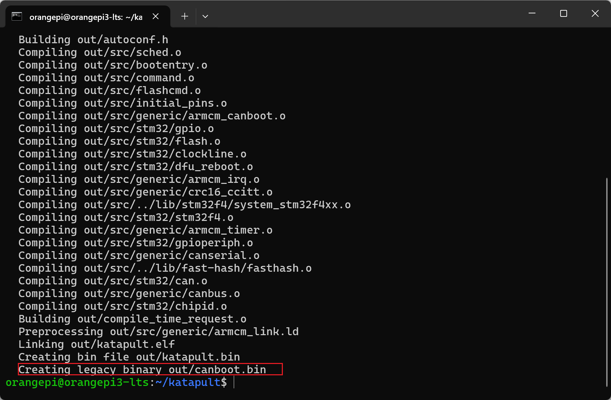

**Enter DFU mode**

Use a jumper to short-circuit the 5V USB jumper. After short-circuiting, you can use USB to power and flash the board. **Remember to remove the jumper after flashing is complete.**

If using 24V power supply, no short-circuit is needed, but you can only use Method 2 below to enter DFU.


**DFU Method 1**: After the board is completely powered off, hold down Boot, connect the board to the host computer using a TypeC cable, then release Boot.

**DFU Method 2**: If the board is not powered off, connect it to the host computer using a TypeC cable, then hold down Boot, press the Reset button, release the Reset button, and finally release the Boot button.

Then use the `lsusb` command to check if there's a DFU device

```bash
lsusb
```

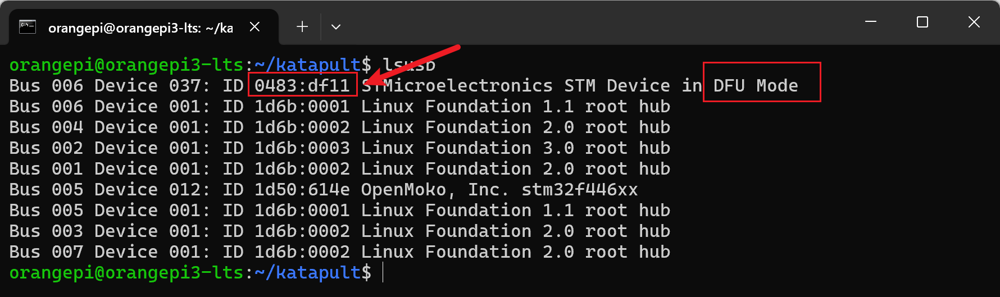

Use the following command to view the DFU device's flash memory address information (should be the same)

```bash
dfu-util -l
```

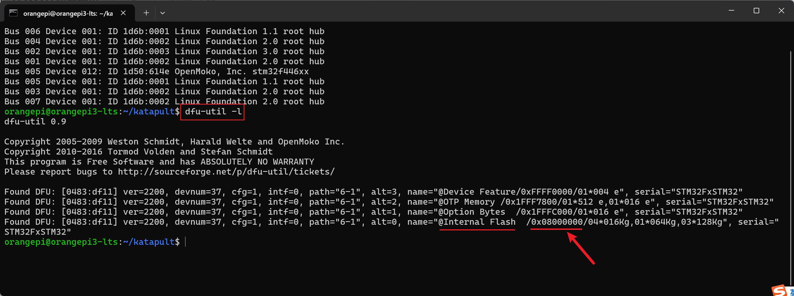

Use the following command to flash canboot

```bash
sudo dfu-util -a 0 -d 0483:df11 --dfuse-address 0x08000000:leave -D out/canboot.bin

# Note 1: 0483:df11 is the device ID, consistent with the previous lsusb
# Note 2: 0x08000000 is the value found from the previous query
# Note 3: out/canboot.bin is the relative path of the firmware
```

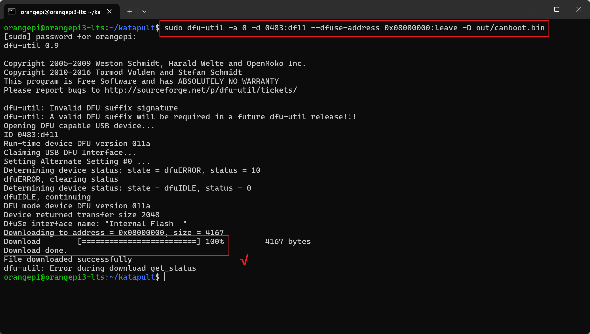

Disconnect the USB cable and connect CAN signal lines and 24V power supply.

**Note 1: Remember to remove the 5V USB jumper.**

**Note 2: If there are multiple CAN devices, only short-circuit the 120Ω resistor on one device**

**Note 3: Pay attention to the wiring sequence of 24V GND CAN-H CAN-L. Check carefully, incorrect wiring may cause board damage at your own risk.**


Use the following command to view the CAN UUID **[You may need to quickly double-click the reset button twice to enter]**

```bash
~/klippy-env/bin/python ~/klipper/scripts/canbus_query.py can0
```

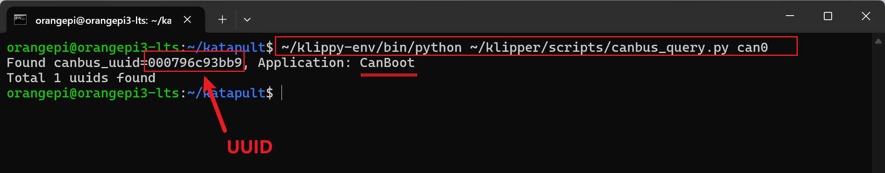

### **3.2 Flash Klipper Firmware**

```bash
# Navigate to klipper directory
cd ~/klipper

# Clean previous compilation
make clean

# Set compilation parameters according to your protocol needs [refer to image below]
# The Bootloader offset value should be consistent with the application offset in canboot compilation, which is 32KiB
make menuconfig
```


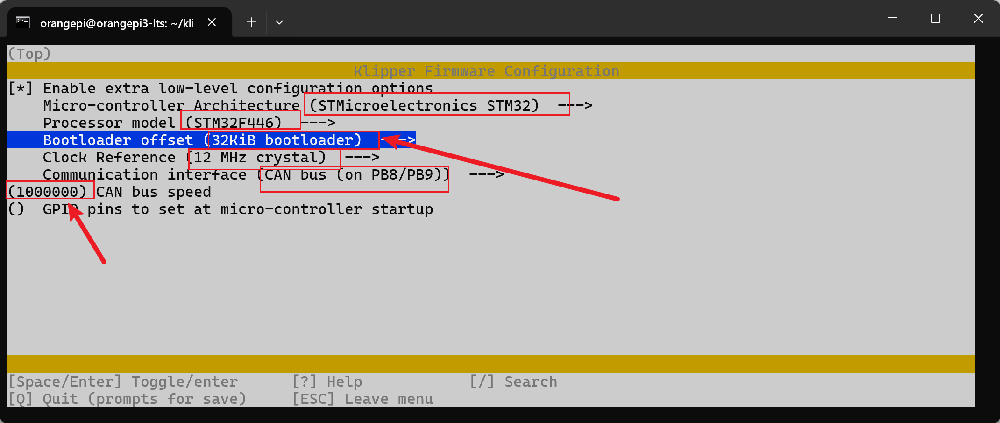

After verification, press q to exit, select y

Then enter make to start compilation

```bash
make
```

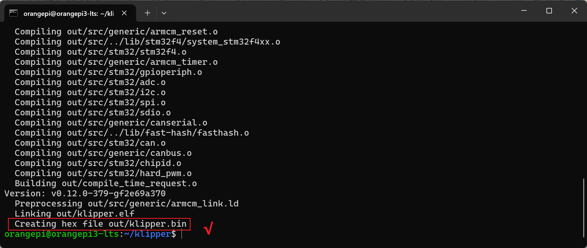

Use the following command to flash in CAN mode

```bash
cd ~/katapult/scripts

python3 flashtool.py -i can0 -f ~/klipper/out/klipper.bin -u replace_with_your_UUID
```

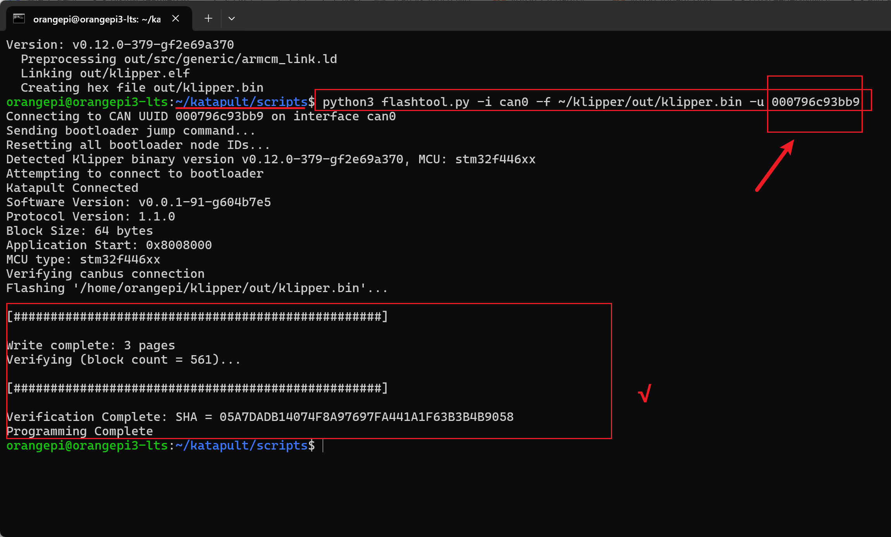

Then continue using the previous command to view CAN information

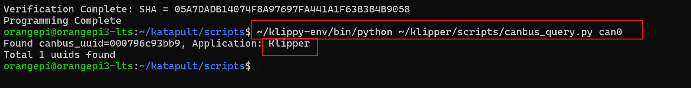

**For future CAN firmware upgrades, repeat the process in section 3.2. When compiling the canboot firmware earlier, double-click reset to enter canboot mode was set.**

**In actual use, you can also directly input the flashing command, and the board will automatically restart and enter canboot.**

## **4. Turtle Multi-Color Wiring Diagram**

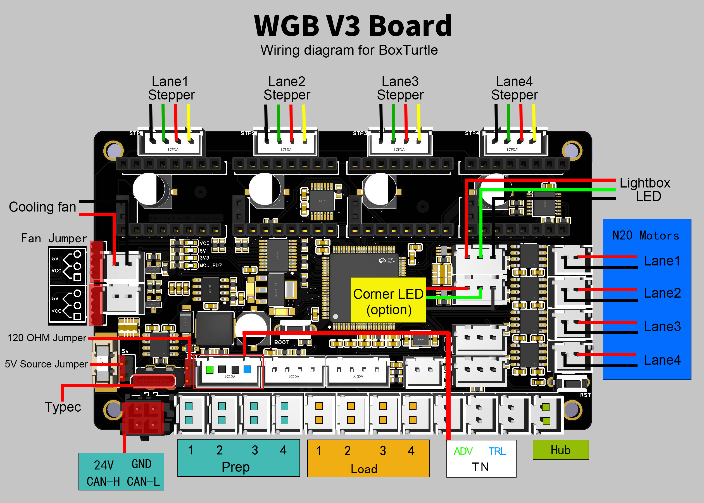

## **5. Configuration**

### **5.1 BT Turtle Software Configuration**

**BoxTurtle board configuration:**

**Use the configuration below to replace /AFC/mcu/AFC_Lite.cfg**

```ini
[board_pins Turtle_1]
mcu: Turtle_1
aliases:
    # Stepper motors
    M1_STEP=PD4    	, M1_DIR=PD3    , M1_EN=PD5   	, M1_UART=PC12   , # M1_DIAG=PD2   ,
    M2_STEP=PD0   	, M2_DIR=PC11   , M2_EN=PD1   	, M2_UART=PC10   , # M2_DIAG=PC10  ,
    M3_STEP=PC8    	, M3_DIR=PA10    , M3_EN=PC9   	, M3_UART=PA9   , # M3_DIAG=PE4   ,
    M4_STEP=PD13   	, M4_DIR=PD12   , M4_EN=PD14   	, M4_UART=PC6   , # M4_DIAG=PC8   ,

    # Recommended pin configuration
    HUB=PE7 		, 
    TRG1=PA1  		, TRG2=PA2  	, TRG3=PA3 		, TRG4=PA4		,
    EXT1=PA5 		, EXT2=PA6	    , EXT3=PA7		, EXT4=PC4		,
	TN_ADV=PB4      , TN_TRL=PB5    ,

    # Limit switch alias settings
    SW1=PA1 		, SW2=PA2 	, SW3=PA3  	, SW4=PA4 	, SW5=PA5	, SW6=PA6	,
    SW7=PA7 		, SW8=PC4	, SW9=PC5	, SW10=PB0	, SW11=PB1	, SW12=PE7	,
    
	# N20 retraction motors
    MOT1_RWD=PE15	, MOT1_FWD=PB10	, MOT1_EN=PD11	,
    MOT2_RWD=PE13	, MOT2_FWD=PE14	, MOT2_EN=PD10	,
    MOT3_RWD=PE11	, MOT3_FWD=PE12	, MOT3_EN=PD9	,
    MOT4_RWD=PE8	, MOT4_FWD=PE10	, MOT4_EN=PD8	,

	# LED configuration
    RGB1=PB15		, RGB2=PB14	,
```

### **5.2 BT Happy Hare Software Configuration**

After installation, you need to modify the pin-related content in the mmu/base/mmu.cfg file. Copy the content below to replace the corresponding content **[Compatible with HH 3.2+ version]**

```ini
[board_pins mmu]
mcu: mmu # Assumes using an external / extra mcu dedicated to MMU
aliases:
    MMU_GEAR_UART=PC12,
    MMU_GEAR_STEP=PD4,
    MMU_GEAR_DIR=PD3,
    MMU_GEAR_ENABLE=PD5,
    MMU_GEAR_DIAG=PD6,

    MMU_GEAR_UART_1=PC10,
    MMU_GEAR_STEP_1=PD0,
    MMU_GEAR_DIR_1=PC11,
    MMU_GEAR_ENABLE_1=PD1,
    MMU_GEAR_DIAG_1=PD2,

    MMU_GEAR_UART_2=PA9,
    MMU_GEAR_STEP_2=PC8,
    MMU_GEAR_DIR_2=PA10,
    MMU_GEAR_ENABLE_2=PC9,
    MMU_GEAR_DIAG_2=PA8,

    MMU_GEAR_UART_3=PC6,
    MMU_GEAR_STEP_3=PD13,
    MMU_GEAR_DIR_3=PD12,
    MMU_GEAR_ENABLE_3=PD14,
    MMU_GEAR_DIAG_3=PD15,

    MMU_SEL_UART=,
    MMU_SEL_STEP=,
    MMU_SEL_DIR=,
    MMU_SEL_ENABLE=,
    MMU_SEL_DIAG=,
    MMU_SEL_ENDSTOP=,
    MMU_SEL_SERVO=,

    MMU_ENCODER=,
    MMU_GATE_SENSOR=PE7,
    MMU_NEOPIXEL=PB15,

    MMU_PRE_GATE_0=PA1,
    MMU_PRE_GATE_1=PA2,
    MMU_PRE_GATE_2=PA3,
    MMU_PRE_GATE_3=PA4,
    MMU_PRE_GATE_4=,
    MMU_PRE_GATE_5=,
    MMU_PRE_GATE_6=,
    MMU_PRE_GATE_7=,
    MMU_PRE_GATE_8=,
    MMU_PRE_GATE_9=,
    MMU_PRE_GATE_10=,
    MMU_PRE_GATE_11=,

    MMU_POST_GEAR_0=PA5,
    MMU_POST_GEAR_1=PA6,
    MMU_POST_GEAR_2=PA7,
    MMU_POST_GEAR_3=PC4,
    MMU_POST_GEAR_4=,
    MMU_POST_GEAR_5=,
    MMU_POST_GEAR_6=,
    MMU_POST_GEAR_7=,
    MMU_POST_GEAR_8=,
    MMU_POST_GEAR_9=,
    MMU_POST_GEAR_10=,
    MMU_POST_GEAR_11=,

    MMU_ESPOOLER_RWD_0=PE15,
    MMU_ESPOOLER_FWD_0=PB10,
    MMU_ESPOOLER_EN_0=PD11,
    MMU_ESPOOLER_TRIG_0=,

    MMU_ESPOOLER_RWD_1=PE13,
    MMU_ESPOOLER_FWD_1=PE14,
    MMU_ESPOOLER_EN_1=PD10,
    MMU_ESPOOLER_TRIG_1=,

    MMU_ESPOOLER_RWD_2=PE11,
    MMU_ESPOOLER_FWD_2=PE12,
    MMU_ESPOOLER_EN_2=PD9,
    MMU_ESPOOLER_TRIG_2=,

    MMU_ESPOOLER_RWD_3=PE8,
    MMU_ESPOOLER_FWD_3=PE10,
    MMU_ESPOOLER_EN_3=PD8,
    MMU_ESPOOLER_TRIG_3=,

```

### **5.3 Electrical Chamber Fan Configuration**

For electrical chamber fans, it's recommended to purchase small speed fans of 3000-6000 RPM, either 5V or 24V.

There are two PIN ports to choose from, both can select 5V or 24V, and both can perform speed control.

Add the following configuration to printer.cfg:

```ini
# Set electrical chamber fan, only enabled when hotend is heating
[heater_fan afc_fan]
pin: Turtle_1:PE9   # Modify according to actual situation
max_power: 1.0
kick_start_time: 0.5
heater: extruder
heater_temp: 50.0
fan_speed: 0.4      # Set the speed you need
```
