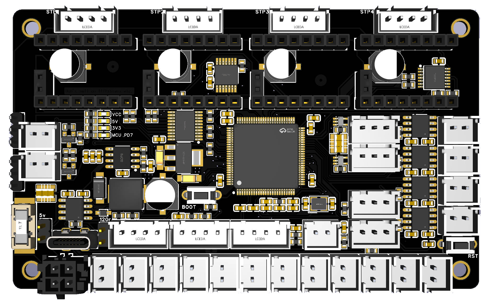
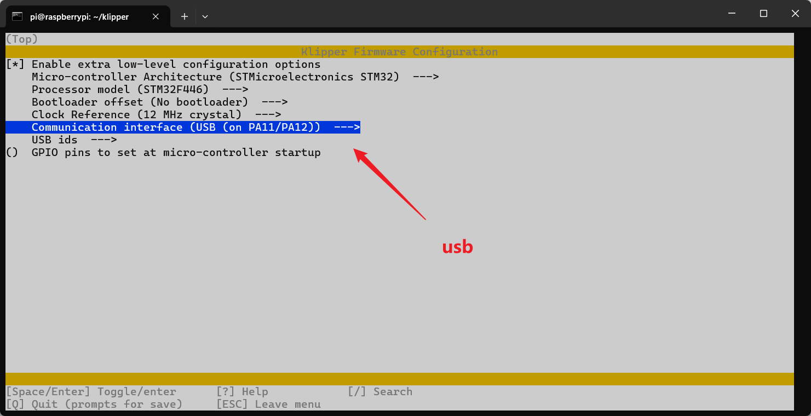
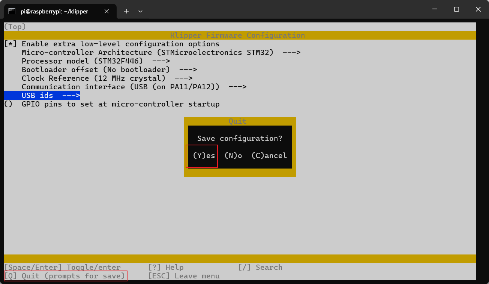
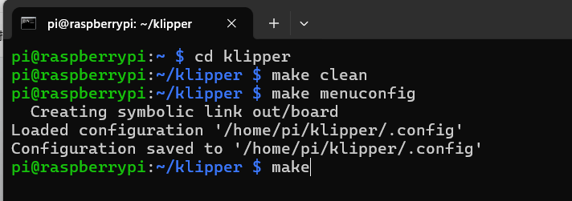
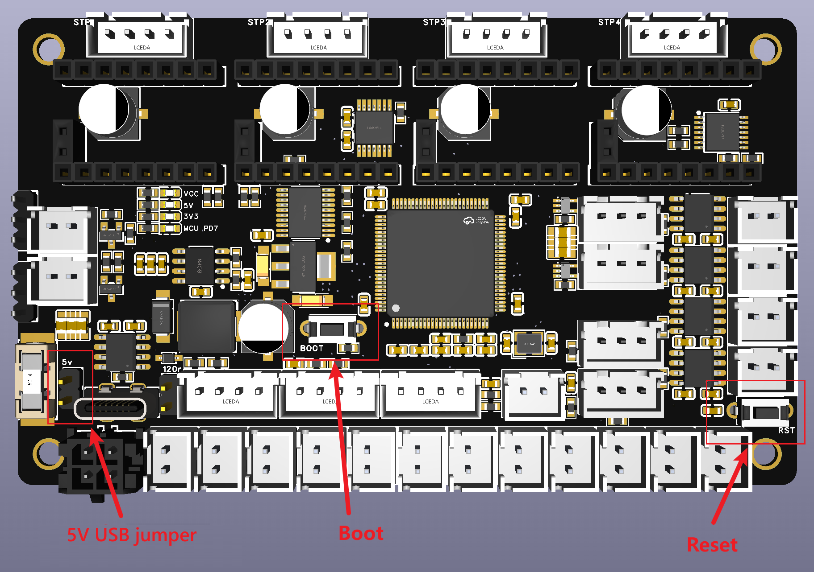
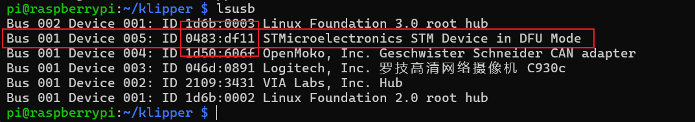
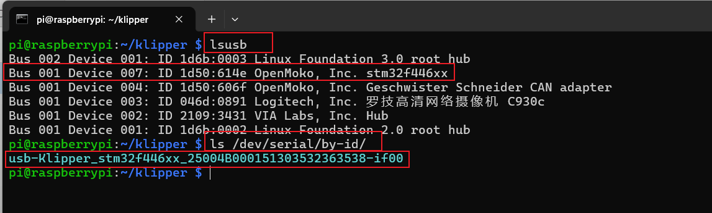
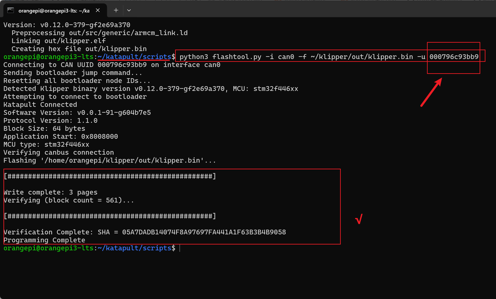

# **WGB V3主板说明书**

[English](README.md) | 中文




**WGB主板 V3版本 (WuGuiBan)** ，是为使用直流电机回卷的B型多色，比如BoxTurtle设计的一款主板。

 

它具有以下特点：

​                ● 主芯片采用 STM32F446 MCU 

​                ● 4 个 基于 TMC2209 的电机插槽，为UART模式，电机和主芯片之间的通信增加了电平转换用于信号隔离。

​                ● 4 x 有刷直流电机驱动器，支持正反转，带En引脚，支持休眠。

​                ● 2 x RGB LED 连接器，支持舵机

​                ● 16 x 微动开关控制连接器，除了满足常规B型多色的需求，为退料按钮、编码器等功能增加冗余接口设计。

​                ● 2 x 5V/24V 风扇连接器（支持速度控制，使用跳线选择电压）

​                ● 1 x i2c接口，可以用于连接温湿度计。

​                ● 1 x 测温接口，配合风扇接口和继电器可用于DIY多色烘干

​                ● USB 和 CAN 支持。CAN采用MX3.0 2x2p 有防呆设计。

​                ● 尺寸与龟盒多色主板AFC-Lite 孔位相同，固定支架可兼容。

 

 

## **1. PIN图**

！！接线图参考第4节！！


 

 

## **2. 刷机教程(无canboot)**

### **2.1 固件编译**

ssh登录到上位机


```
# cd 到klipper目录
cd ~/klipper
 
# 清除上次的编译
make clean
 
# 配置编译参数[参考下图]
make menuconfig
```


 


根据自己需要使用的协议设置编译参数




按q退出，y保存



 

输入make命令开始编译


```
make
```


 




 

### **2.2 刷机**

 

1：进dfu模式 

使用跳线短接5V USB跳线，短接后即可使用USB对主板进行供电刷机，**刷机结束记得拔掉跳线。**

如果使用24V进行供电则不需要短接，但是只能使用下面的方法二进入DFU。



进入DFU方法一：主板完全断电后，按住Boot，使用TypeC线将主板接到上位机，然后松开Boot 

进入DFU方法二：如果主板不断电，那就使用TypeC线连接到上位机后，先按住Boot，再按下Reset按键，松开Reset按键，最后松开Boot按键 

 

 

2：在ssh里输入lsusb查看是否出现dfu设备，正常就会出现dfu设备，

没有出现dfu就重新操作一次



 

3：在ssh里输入 


```
# 确保在klipper目录下
cd ~/klipper
 
# 0483:df11 为前面lsusb查到的id
# 提示找不到make，使用sudo apt install dfu-util -y  安装一下
 
make flash FLASH_DEVICE=0483:df11
```


 

然后就会进行烧录操作【可能需要输入密码】，等进度条走完并出现successfully就说明烧录成功了，successfully

后面的报错不必理会。


刷机完毕

 

**2.3** **获取串口id或者can的uuid**

 

**2.3.1** **如果是USB协议：**

重新拔插usb数据线，使用lsusb查看下有没有stm32f446 的设备

使用下面的命令查看下设备串口id


```
ls /dev/serial/by-id/
```


 



此设备的设备串口id为


```
serial: /dev/serial/by-id/usb-Klipper_stm32f446xx_25004B000151303532363538-if00
```


**后期使用请拔掉5V USB 跳线，并在can接口接入24V 供电**

 

 

**2.3.2** **如果是Can协议：**

连接can信号线和24V供电。

**注意1：记得拔掉5V USB跳线。**

**注意2：如果有多个can设备，只需要在一个设备上将120欧进行短接**

**注意3：注意24V GND CAN-H CAN-L的线序，仔细核对，线序错误可能造成主板烧毁，后果自负。**


然后使用下面的命令参看uuid：


```
~/klippy-env/bin/python ~/klipper/scripts/canbus_query.py can0
```


 


 

## **3. 刷机教程(含Canboot)**

需要使用canboot(katapult)的按下面的教程刷机

 

首先ssh工具登录到上位机


```
ssh 用户名@IP地址
```


 

 

### **3.1 刷写 canboot**


```
# 进入家目录
cd ~
 
# 下载katapult（已有的略过）
git clone https://github.com/Arksine/katapult
 
# 进入katapult目录
cd katapult
```


 


```
#修改编译配置，按下面图中参数填写
make menuconfig
 
#核对无误后，按q 退出，选择y ,然后输入make开始编译
make
```


 


 

**进dfu模式** 

使用跳线短接5V USB跳线，短接后即可使用USB对主板进行供电刷机，**刷机结束记得拔掉跳线。**

如果使用24V进行供电则不需要短接，但是只能使用下面的方法二进入DFU。


进入DFU方法一：主板完全断电后，按住Boot，使用TypeC线将主板接到上位机，然后松开Boot 

进入DFU方法二：如果主板不断电，那就使用TypeC线连接到上位机后，先按住Boot，再按下Reset按键，松开Reset按键，最后松开Boot按键 

 

 

然后使用lsusb命令查看是否有DFU的设备


```
lsusb
```


 


 

使用下面的命令查看DFU设备的闪存地址信息（应该都一样）


```
dfu-util -l
```


 


使用下面的命令刷写canboot


```
sudo dfu-util -a 0 -d 0483:df11 --dfuse-address 0x08000000:leave -D out/canboot.bin
 
# 备注1：0483:df11为设备ID，与前面lsusb一致
# 备注2：0x08000000 为前面查询到的数值
# 备注3：out/canboot.bin为固件的相对路径
```


 


 

拔下USB线，连接can信号线和24V供电。

**注意1：记得拔掉5V USB跳线。**

**注意2：如果有多个can设备，只需要在一个设备上将120欧进行短接**

**注意3：注意24V GND CAN-H CAN-L的线序，仔细核对，线序错误可能造成主板烧毁，后果自负。**


 

使用下面的命令查看can的UUID,**[可能需要快速双击reset按键两次才能进入]**


```
~/klippy-env/bin/python ~/klipper/scripts/canbus_query.py can0
```


 


 

 

### **3.2 刷写klipper**


```
# cd 到klipper目录
cd ~/klipper
 
# 清除上次的编译
make clean
 
# 根据自己需要使用的协议设置编译参数[参考下图]
# 其中Bootloader offset 数值要与canboot编译中的application offset 一致，为32KiB
make menuconfig
```


 


核对无误后，按q 退出，选择y

然后输入make开始编译


```
make
```


 

 

使用下面的命令在can模式下进行刷机


```
cd ~/katapult/scripts
 
python3 flashtool.py -i can0 -f ~/klipper/out/klipper.bin -u 替换为你的UUID
```


 



然后继续使用前面的命令查看can的信息


 

**以后需要升级can固件的话就重复3.2的过程，前面在编译canboot固件的时候设置了双击reset进入canboot模式**

**实际使用中，也可以直接输入刷机命令，板子会自动重启进入canboot。**

 

 

##             4.     **乌龟多色接线图**


 

##             5.     **配置**

### **5.1** **BT的乌龟软件配置**

**BoxTurtle的主板配置：**

**使用下面的配置替换/AFC/mcu/AFC_Lite.cfg**


```
[board_pins Turtle_1]
mcu: Turtle_1
aliases:
    # 步进电机
    M1_STEP=PD4    	, M1_DIR=PD3    , M1_EN=PD5   	, M1_UART=PC12   , # M1_DIAG=PD2   ,
    M2_STEP=PD0   	, M2_DIR=PC11   , M2_EN=PD1   	, M2_UART=PC10   , # M2_DIAG=PC10  ,
    M3_STEP=PC8    	, M3_DIR=PA10    , M3_EN=PC9   	, M3_UART=PA9   , # M3_DIAG=PE4   ,
    M4_STEP=PD13   	, M4_DIR=PD12   , M4_EN=PD14   	, M4_UART=PC6   , # M4_DIAG=PC8   ,
 
    # 建议的pin配置
    HUB=PE7 		, 
    TRG1=PA1  		, TRG2=PA2  	, TRG3=PA3 		, TRG4=PA4		,
    EXT1=PA5 		, EXT2=PA6	    , EXT3=PA7		, EXT4=PC4		,
	TN_ADV=PB4      , TN_TRL=PB5    ,
 
    # 限位开关的别名设置
    SW1=PA1 		, SW2=PA2 	, SW3=PA3  	, SW4=PA4 	, SW5=PA5	, SW6=PA6	,
    SW7=PA7 		, SW8=PC4	, SW9=PC5	, SW10=PB0	, SW11=PB1	, SW12=PE7	,
    
	# N20回卷马达
    MOT1_RWD=PE15	, MOT1_FWD=PB10	, MOT1_EN=PD11	,
    MOT2_RWD=PE13	, MOT2_FWD=PE14	, MOT2_EN=PD10	,
    MOT3_RWD=PE11	, MOT3_FWD=PE12	, MOT3_EN=PD9	,
    MOT4_RWD=PE8	, MOT4_FWD=PE10	, MOT4_EN=PD8	,
 
	# LED配置
    RGB1=PB15		, RGB2=PB14	,
```


 

 

### **5.2** **BT的快乐兔软件配置**

安装之后需要去mmu/base/mmu.cfg 文件中修改pin的相关内容，复制下面的内容覆盖对应内容即可**【适配HH3.2以上版本】**


```
[board_pins mmu]
mcu: mmu # Assumes using an external / extra mcu dedicated to MMU
aliases:
    MMU_GEAR_UART=PC12,
    MMU_GEAR_STEP=PD4,
    MMU_GEAR_DIR=PD3,
    MMU_GEAR_ENABLE=PD5,
    MMU_GEAR_DIAG=PD6,
 
    MMU_GEAR_UART_1=PC10,
    MMU_GEAR_STEP_1=PD0,
    MMU_GEAR_DIR_1=PC11,
    MMU_GEAR_ENABLE_1=PD1,
    MMU_GEAR_DIAG_1=PD2,
 
    MMU_GEAR_UART_2=PA9,
    MMU_GEAR_STEP_2=PC8,
    MMU_GEAR_DIR_2=PA10,
    MMU_GEAR_ENABLE_2=PC9,
    MMU_GEAR_DIAG_2=PA8,
 
    MMU_GEAR_UART_3=PC6,
    MMU_GEAR_STEP_3=PD13,
    MMU_GEAR_DIR_3=PD12,
    MMU_GEAR_ENABLE_3=PD14,
    MMU_GEAR_DIAG_3=PD15,
 
    MMU_SEL_UART=,
    MMU_SEL_STEP=,
    MMU_SEL_DIR=,
    MMU_SEL_ENABLE=,
    MMU_SEL_DIAG=,
    MMU_SEL_ENDSTOP=,
    MMU_SEL_SERVO=,
 
    MMU_ENCODER=,
    MMU_GATE_SENSOR=PE7,
    MMU_NEOPIXEL=PB15,
 
    MMU_PRE_GATE_0=PA1,
    MMU_PRE_GATE_1=PA2,
    MMU_PRE_GATE_2=PA3,
    MMU_PRE_GATE_3=PA4,
    MMU_PRE_GATE_4=,
    MMU_PRE_GATE_5=,
    MMU_PRE_GATE_6=,
    MMU_PRE_GATE_7=,
    MMU_PRE_GATE_8=,
    MMU_PRE_GATE_9=,
    MMU_PRE_GATE_10=,
    MMU_PRE_GATE_11=,
 
    MMU_POST_GEAR_0=PA5,
    MMU_POST_GEAR_1=PA6,
    MMU_POST_GEAR_2=PA7,
    MMU_POST_GEAR_3=PC4,
    MMU_POST_GEAR_4=,
    MMU_POST_GEAR_5=,
    MMU_POST_GEAR_6=,
    MMU_POST_GEAR_7=,
    MMU_POST_GEAR_8=,
    MMU_POST_GEAR_9=,
    MMU_POST_GEAR_10=,
    MMU_POST_GEAR_11=,
 
    MMU_ESPOOLER_RWD_0=PE15,
    MMU_ESPOOLER_FWD_0=PB10,
    MMU_ESPOOLER_EN_0=PD11,
    MMU_ESPOOLER_TRIG_0=,
 
    MMU_ESPOOLER_RWD_1=PE13,
    MMU_ESPOOLER_FWD_1=PE14,
    MMU_ESPOOLER_EN_1=PD10,
    MMU_ESPOOLER_TRIG_1=,
 
    MMU_ESPOOLER_RWD_2=PE11,
    MMU_ESPOOLER_FWD_2=PE12,
    MMU_ESPOOLER_EN_2=PD9,
    MMU_ESPOOLER_TRIG_2=,
 
 
    MMU_ESPOOLER_RWD_3=PE8,
    MMU_ESPOOLER_FWD_3=PE10,
    MMU_ESPOOLER_EN_3=PD8,
    MMU_ESPOOLER_TRIG_3=,
 
```


 

### **5.3** **电气仓风扇配置**

电器仓风扇推荐购买小转速3000-6000的即可，5V或者24V都可以

有两个PIN口可供选择，两个都可以选择5V或者24V，都可以进行调速控制。

 

将下面的配置添加到printer.cfg中


```
# 设置电气仓风扇，仅当热端加热的时候启用
[heater_fan afc_fan]
pin: Turtle_1:PE9   # 根据实际情况修改
max_power: 1.0
kick_start_time: 0.5
heater: extruder
heater_temp: 50.0
fan_speed: 0.4      # 设置你需要的速度
```


 

 

 

 

 